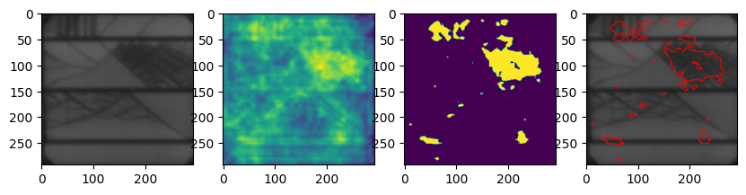

# Solar Cell Defect Detection Using Anomalib



## Training

1. Install requirements:

    ```bash
    pip install -r requirements.txt
    ```

2. Set the API key for Roboflow in `train.py`:
`rf = Roboflow(api_key="API")`

3. Run training:

    ```bash
    python train.py
    ```

4. Perform inference using inferencer:

    ```bash
    python gradio_inferencer.py --weights results/custom/run/weights/torch/model.pt
    ```

## Acknowledgement

Dataset: [Solar-Cell-Defect](https://universe.roboflow.com/msa-b0qan/solar-cell-6pvhl)
